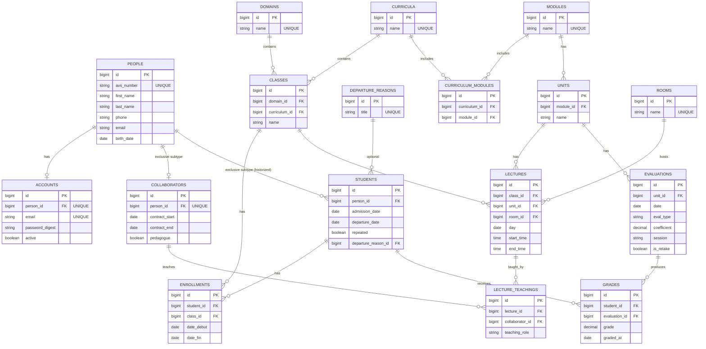

```sql
START TRANSACTION;

-- =====================================================
-- PEOPLE
-- =====================================================

CREATE TABLE IF NOT EXISTS people (
    id            BIGINT PRIMARY KEY,
    avs_number    VARCHAR(255) NOT NULL,
    city          VARCHAR(255),
    birth_date    DATE,
    first_name    VARCHAR(255) NOT NULL,
    last_name     VARCHAR(255) NOT NULL,
    postal_code   VARCHAR(20),
    street        VARCHAR(255),
    street_number TINYINT,
    phone_number  VARCHAR(50),
    CONSTRAINT uq_people_avs UNIQUE (avs_number)
) ENGINE=InnoDB DEFAULT CHARSET=utf8mb4 COLLATE=utf8mb4_unicode_ci;

-- =====================================================
-- ACCOUNTS
-- =====================================================

CREATE TABLE IF NOT EXISTS accounts (
    id BIGINT PRIMARY KEY,
    email VARCHAR(255) NOT NULL,
    encrypted_password VARCHAR(255) NOT NULL,
    enabled BOOLEAN NOT NULL,
    person_id BIGINT NOT NULL,
    CONSTRAINT fk_accounts_person FOREIGN KEY (person_id) REFERENCES people(id),
    CONSTRAINT uq_accounts_email UNIQUE (email)
) ENGINE=InnoDB DEFAULT CHARSET=utf8mb4 COLLATE=utf8mb4_unicode_ci;

-- =====================================================
-- COLLABORATORS
-- =====================================================

CREATE TABLE IF NOT EXISTS collaborators (
    id BIGINT PRIMARY KEY,
    contract_begin DATE,
    contract_end DATE,
    person_id BIGINT NOT NULL,
    CONSTRAINT fk_collaborators_person FOREIGN KEY (person_id) REFERENCES people(id),
    CONSTRAINT uq_collaborator_person UNIQUE (person_id)
) ENGINE=InnoDB DEFAULT CHARSET=utf8mb4 COLLATE=utf8mb4_unicode_ci;

CREATE TABLE IF NOT EXISTS collaborator_roles (
    id BIGINT PRIMARY KEY,
    title VARCHAR(255) NOT NULL,
    CONSTRAINT uq_collaborator_roles_title UNIQUE (title)
) ENGINE=InnoDB DEFAULT CHARSET=utf8mb4 COLLATE=utf8mb4_unicode_ci;

CREATE TABLE IF NOT EXISTS collaborator_assignments (
    id BIGINT PRIMARY KEY,
    collaborator_id BIGINT NOT NULL,
    collaborator_role_id BIGINT NOT NULL,
    CONSTRAINT fk_assignment_collaborator FOREIGN KEY (collaborator_id) REFERENCES collaborators(id),
    CONSTRAINT fk_assignment_role FOREIGN KEY (collaborator_role_id) REFERENCES collaborator_roles(id),
    CONSTRAINT uq_collaborator_role UNIQUE (collaborator_id, collaborator_role_id)
) ENGINE=InnoDB DEFAULT CHARSET=utf8mb4 COLLATE=utf8mb4_unicode_ci;

-- =====================================================
-- STUDENTS
-- =====================================================

CREATE TABLE IF NOT EXISTS departure_reasons (
    id BIGINT PRIMARY KEY,
    title VARCHAR(255) NOT NULL,
    CONSTRAINT uq_departure_reason_title UNIQUE (title)
) ENGINE=InnoDB DEFAULT CHARSET=utf8mb4 COLLATE=utf8mb4_unicode_ci;

CREATE TABLE IF NOT EXISTS students (
    id BIGINT PRIMARY KEY,
    admission_date DATE,
    departure_date DATE,
    departure_reason_id BIGINT,
    person_id BIGINT NOT NULL,
    repeating_grade BOOLEAN NOT NULL,
    CONSTRAINT fk_students_person FOREIGN KEY (person_id) REFERENCES people(id),
    CONSTRAINT fk_students_departure FOREIGN KEY (departure_reason_id) REFERENCES departure_reasons(id),
    CONSTRAINT uq_student_person UNIQUE (person_id)
) ENGINE=InnoDB DEFAULT CHARSET=utf8mb4 COLLATE=utf8mb4_unicode_ci;

-- =====================================================
-- FORMATION PLANS & CLASSES
-- =====================================================

CREATE TABLE IF NOT EXISTS formation_plans (
    id BIGINT PRIMARY KEY,
    name VARCHAR(255) NOT NULL,
    CONSTRAINT uq_formation_plan_name UNIQUE (name)
) ENGINE=InnoDB DEFAULT CHARSET=utf8mb4 COLLATE=utf8mb4_unicode_ci;

CREATE TABLE IF NOT EXISTS school_classes (
    id BIGINT PRIMARY KEY,
    formation_plan_id BIGINT NOT NULL,
    name VARCHAR(255) NOT NULL,
    responsible_collaborator_id BIGINT NOT NULL,
    CONSTRAINT fk_classes_plan FOREIGN KEY (formation_plan_id) REFERENCES formation_plans(id),
    CONSTRAINT fk_classes_responsible FOREIGN KEY (responsible_collaborator_id) REFERENCES collaborators(id)
) ENGINE=InnoDB DEFAULT CHARSET=utf8mb4 COLLATE=utf8mb4_unicode_ci;

CREATE TABLE IF NOT EXISTS class_enrollments (
    id BIGINT PRIMARY KEY,
    school_class_id BIGINT NOT NULL,
    student_id BIGINT NOT NULL,
    CONSTRAINT fk_enrollment_class FOREIGN KEY (school_class_id) REFERENCES school_classes(id),
    CONSTRAINT fk_enrollment_student FOREIGN KEY (student_id) REFERENCES students(id),
    CONSTRAINT uq_class_student UNIQUE (school_class_id, student_id)
) ENGINE=InnoDB DEFAULT CHARSET=utf8mb4 COLLATE=utf8mb4_unicode_ci;

-- =====================================================
-- MODULES & UNITS
-- =====================================================

CREATE TABLE IF NOT EXISTS learning_modules (
    id BIGINT PRIMARY KEY,
    name VARCHAR(255) NOT NULL,
    CONSTRAINT uq_learning_module_name UNIQUE (name)
) ENGINE=InnoDB DEFAULT CHARSET=utf8mb4 COLLATE=utf8mb4_unicode_ci;

CREATE TABLE IF NOT EXISTS units (
    id BIGINT PRIMARY KEY,
    name VARCHAR(255) NOT NULL,
    CONSTRAINT uq_unit_name UNIQUE (name)
) ENGINE=InnoDB DEFAULT CHARSET=utf8mb4 COLLATE=utf8mb4_unicode_ci;

CREATE TABLE IF NOT EXISTS module_units (
    id BIGINT PRIMARY KEY,
    learning_module_id BIGINT NOT NULL,
    unit_id BIGINT NOT NULL,
    CONSTRAINT fk_module_units_module FOREIGN KEY (learning_module_id) REFERENCES learning_modules(id),
    CONSTRAINT fk_module_units_unit FOREIGN KEY (unit_id) REFERENCES units(id),
    CONSTRAINT uq_module_unit UNIQUE (learning_module_id, unit_id)
) ENGINE=InnoDB DEFAULT CHARSET=utf8mb4 COLLATE=utf8mb4_unicode_ci;

CREATE TABLE IF NOT EXISTS formation_plan_modules (
    id BIGINT PRIMARY KEY,
    formation_plan_id BIGINT NOT NULL,
    learning_module_id BIGINT NOT NULL,
    CONSTRAINT fk_plan_modules_plan FOREIGN KEY (formation_plan_id) REFERENCES formation_plans(id),
    CONSTRAINT fk_plan_modules_module FOREIGN KEY (learning_module_id) REFERENCES learning_modules(id),
    CONSTRAINT uq_plan_module UNIQUE (formation_plan_id, learning_module_id)
) ENGINE=InnoDB DEFAULT CHARSET=utf8mb4 COLLATE=utf8mb4_unicode_ci;

-- =====================================================
-- ROOMS & LECTURES
-- =====================================================

CREATE TABLE IF NOT EXISTS rooms (
    id BIGINT PRIMARY KEY,
    name VARCHAR(255) NOT NULL,
    CONSTRAINT uq_room_name UNIQUE (name)
) ENGINE=InnoDB DEFAULT CHARSET=utf8mb4 COLLATE=utf8mb4_unicode_ci;

CREATE TABLE IF NOT EXISTS lectures (
    id BIGINT PRIMARY KEY,
    collaborator_id BIGINT NOT NULL,
    date DATE NOT NULL,
    end_time TIME NOT NULL,
    room_id BIGINT NOT NULL,
    start_time TIME NOT NULL,
    unit_id BIGINT NOT NULL,
    CONSTRAINT fk_lectures_collaborator FOREIGN KEY (collaborator_id) REFERENCES collaborators(id),
    CONSTRAINT fk_lectures_room FOREIGN KEY (room_id) REFERENCES rooms(id),
    CONSTRAINT fk_lectures_unit FOREIGN KEY (unit_id) REFERENCES units(id)
) ENGINE=InnoDB DEFAULT CHARSET=utf8mb4 COLLATE=utf8mb4_unicode_ci;

-- =====================================================
-- GRADES
-- =====================================================

CREATE TABLE IF NOT EXISTS grades (
    id BIGINT PRIMARY KEY,
    awarded_on DATE,
    student_id BIGINT NOT NULL,
    unit_id BIGINT NOT NULL,
    value DECIMAL(3,1),
    CONSTRAINT fk_grades_student FOREIGN KEY (student_id) REFERENCES students(id),
    CONSTRAINT fk_grades_unit FOREIGN KEY (unit_id) REFERENCES units(id),
    CONSTRAINT uq_grade UNIQUE (student_id, unit_id, awarded_on)
) ENGINE=InnoDB DEFAULT CHARSET=utf8mb4 COLLATE=utf8mb4_unicode_ci;

-- =====================================================
-- INDEXES
-- =====================================================

CREATE INDEX idx_students_person ON students(person_id);
CREATE INDEX idx_collaborators_person ON collaborators(person_id);
CREATE INDEX idx_enrollments_student ON class_enrollments(student_id);
CREATE INDEX idx_lectures_unit ON lectures(unit_id);

COMMIT;
```