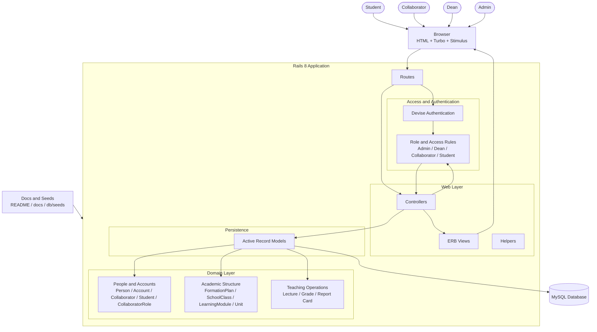
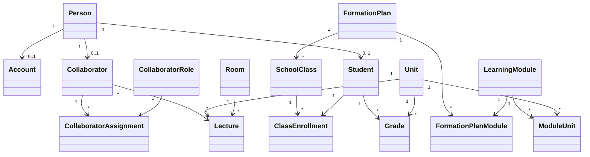
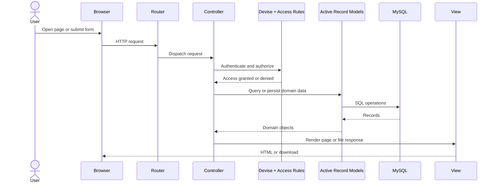

# Application Architecture

## Overview

Ror1 School Manager is a server-rendered Rails application.

It uses:

- Rails controllers and ERB views for the web interface
- Devise for authentication
- Active Record for domain modeling and persistence
- MySQL as the main data store
- Hotwire for progressive enhancement

There is no separate frontend SPA and no separate API service in the current architecture.

## High-Level Architecture Diagram

## Main Layers

### 1. Users and browser

Users interact with the application through a browser.

The UI is rendered on the server with ERB templates and enhanced with:

- Turbo
- Stimulus
- Importmap-managed JavaScript

### 2. Routing and controllers

Rails routes dispatch requests to controllers.

Main controller areas:

- general authenticated pages
  - `ProfilesController`
  - `SchedulesController`
  - `DashboardController`
- management area
  - `Admin::*Controller`

The admin namespace is also used by Deans for most management flows.

### 3. Authentication and authorization

Authentication is handled by Devise through the `Account` model.

Authorization is currently a mix of:

- admin flag on `Account`
- dean detection through collaborator role title `Dean`
- collaborator-specific access rules
- student-specific self-service pages

Important access boundaries:

- Admins and Deans can access the management area
- Collaborators can access teaching-related non-admin flows
- Students can access self-service schedule and grade views

### 4. Domain model

The domain is organized around three main functional groups.

#### People and identity

- `Person`
- `Account`
- `Collaborator`
- `Student`
- `CollaboratorRole`
- `CollaboratorAssignment`

#### Academic structure

- `FormationPlan`
- `SchoolClass`
- `ClassEnrollment`
- `LearningModule`
- `FormationPlanModule`
- `Unit`
- `ModuleUnit`

#### Teaching and follow-up

- `Lecture`
- `Room`
- `Grade`

Report cards are currently generated from student data and grades through the people management flow.

## Domain Relationship Diagram

## Typical Request Flow

## Persistence Model

The application stores its core business data in MySQL.

Main persisted areas:

- people and linked accounts
- collaborator and student role records
- formation plans and school classes
- learning modules and units
- lectures and rooms
- grades

Rails also includes Solid components in the stack:

- Solid Queue
- Solid Cache
- Solid Cable

## Runtime Characteristics

### Web application style

- monolithic Rails app
- server-rendered HTML
- no separate backend API service required for the normal UI

### Authentication model

- sign-in through Devise
- public sign-up disabled
- accounts are created by management users

### Authorization model

- account-level admin flag
- role-derived dean capability
- collaborator teaching scope for some grade flows
- student self-view only for grades and schedule

## Infrastructure Notes

The repository also contains deployment-oriented infrastructure:

- `Dockerfile` for production image builds
- `config/deploy.yml` for Kamal deployment

So the architecture can be viewed in two layers:

1. application architecture
2. deployment/runtime packaging

This document focuses on the application architecture.

## Relevant Files

- `app/controllers/application_controller.rb`
- `app/controllers/admin/base_controller.rb`
- `app/models/account.rb`
- `app/models/person.rb`
- `app/models/collaborator.rb`
- `app/models/student.rb`
- `app/models/unit.rb`
- `app/models/grade.rb`
- `config/routes.rb`
- `config/database.yml`
- `Dockerfile`
- `config/deploy.yml`
