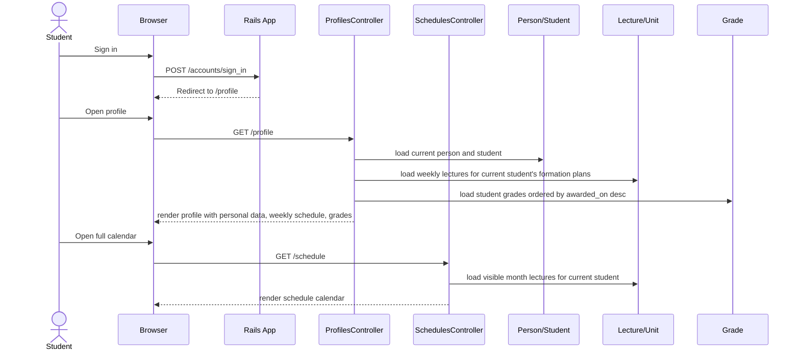
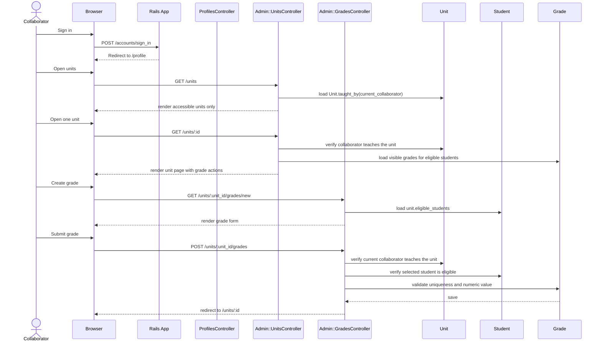
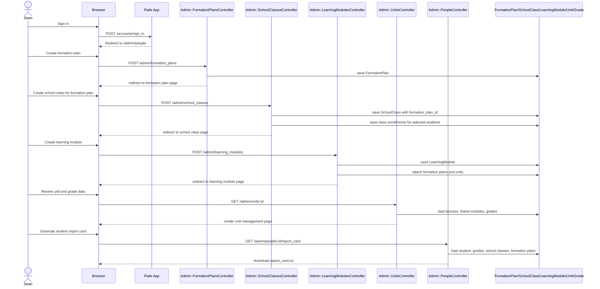

# Role-Based App Flows

## Overview

This document describes the main end-user flows of the application from a technical point of view.

It focuses on three roles:

- Student
- Collaborator
- Dean

The current access hierarchy is:

1. Admin
2. Dean
3. Other authenticated users

Technical note:

- `Admin` is driven by the `accounts.admin` flag.
- `Dean` is a standard account linked to a collaborator whose collaborator role title is `Dean`.
- Deans use the admin area like admins for most academic flows, but they are restricted from deleting or demoting admin accounts.

## Main Entry Points

### Student

- `/profile`
- `/schedule`

### Collaborator

- `/profile`
- `/schedule`
- `/units`
- `/units/:id`
- `/units/:unit_id/grades/new`

### Dean

- `/admin/people`
- `/admin/formation_plans`
- `/admin/school_classes`
- `/admin/learning_modules`
- `/admin/units`
- `/admin/people/:id/report_card`

## Student Flow

### Goal

A student signs in, reviews their profile, sees their schedule, and checks their grades.

### What the app does

- After sign-in, a non-admin, non-dean account lands on `/profile`.
- The profile page loads:
  - person details,
  - weekly schedule preview,
  - grade list if the person has a student record.
- The full calendar is available from `/schedule`.
- Student grades are read-only.

### Sequence Diagram

### Relevant Files

- `app/controllers/profiles_controller.rb`
- `app/controllers/schedules_controller.rb`
- `app/models/student.rb`
- `app/views/profiles/show.html.erb`

## Collaborator Flow

### Goal

A collaborator signs in, reviews their schedule, opens the units they teach, and records grades for eligible students.

### What the app does

- A collaborator signs in and lands on `/profile`.
- The profile page shows:
  - collaborator role details,
  - weekly schedule preview.
- The collaborator can open `/schedule` for the monthly view.
- The collaborator can open `/units` and only sees units taught through their lectures.
- From a unit page, the collaborator can:
  - review visible grades,
  - create a new grade,
  - edit or delete grades for that unit.

Important access rules:

- A collaborator can only manage grades for units returned by `Unit.taught_by(current_collaborator)`.
- A collaborator can only grade students returned by `@unit.eligible_students`.
- If the student does not belong to a formation plan that includes the unit, the grade is rejected.

### Sequence Diagram

### Relevant Files

- `app/controllers/profiles_controller.rb`
- `app/controllers/schedules_controller.rb`
- `app/controllers/admin/units_controller.rb`
- `app/controllers/admin/grades_controller.rb`
- `app/models/unit.rb`
- `app/views/admin/units/index.html.erb`
- `app/views/admin/units/show.html.erb`

## Dean Flow

### Goal

A Dean manages the academic structure and can generate report cards for students.

### What the app does

- A Dean signs in and is redirected to the management area.
- The Dean can use admin pages for:
  - people,
  - formation plans,
  - school classes,
  - learning modules,
  - units,
  - grades,
  - lectures,
  - report cards.

Typical academic setup flow:

1. Create a formation plan.
2. Create a school class and assign it to that formation plan.
3. Assign a responsible collaborator to the class.
4. Enroll students in the class.
5. Create or reuse units.
6. Create a learning module.
7. Link the learning module to the formation plan.
8. Link units to the learning module.
9. Create lectures for collaborators on those units.
10. Later, review student grades and generate report cards.

Important access rules:

- Deans share most admin pages through the same `admin/*` routes.
- Deans can generate student report cards from the admin person page.
- Deans cannot:
  - delete an admin account,
  - delete a person linked to an admin account,
  - disable or remove admin access from an admin account.

### Sequence Diagram

### Relevant Files

- `app/controllers/application_controller.rb`
- `app/controllers/admin/base_controller.rb`
- `app/controllers/admin/formation_plans_controller.rb`
- `app/controllers/admin/school_classes_controller.rb`
- `app/controllers/admin/learning_modules_controller.rb`
- `app/controllers/admin/units_controller.rb`
- `app/controllers/admin/people_controller.rb`
- `app/models/account.rb`
- `app/models/collaborator.rb`
- `app/views/admin/formation_plans/show.html.erb`
- `app/views/admin/school_classes/_form.html.erb`
- `app/views/admin/learning_modules/_form.html.erb`
- `app/views/admin/people/show.html.erb`

## Cross-Role Dependency Notes

These flows are connected by data dependencies:

- Students only see lectures that match the formation plans of their enrolled school classes.
- Collaborators only manage grades for units they teach through lectures.
- A unit becomes grade-relevant for a student only when:
  - the unit is linked to a learning module,
  - the learning module is linked to a formation plan,
  - the student belongs to a school class using that formation plan.
- Report cards depend on the grades already recorded for the student's units.

## Suggested Reading Order

If you want to understand the app progressively, this order works well:

1. `docs/authentication_and_invitation_flow.md`
2. `docs/grades_process.md`
3. this document
